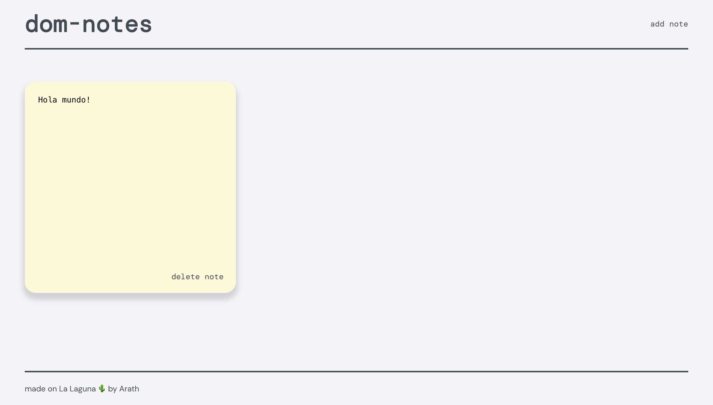

# DOM-Notes

DOM-Notes is a lightweight web app built with vanilla JavaScript, Vite, and SCSS. It allows users to create, edit, and delete notes, storing them in local storage. The app is fully responsive.

## Live Demo
<a href="https://dom-notes.netlify.app/" target="_blank" rel="noopener noreferrer">🚀 Deploy</a>
<a href="https://github.com/arselt/js-dom-notes" target="_blank" rel="noopener noreferrer">📄 GitHub Repository</a>



## Features
- Create, edit, and delete notes
- Saves data in local storage (no backend required)
- Built with vanilla JavaScript and SCSS
- Fully responsive design

## Installation

To run this project locally, follow these steps:

1. Clone the repository:
   ```sh
   git clone https://github.com/arselt/js-dom-notes.git
   cd js-dom-notes
   ```
2. Install dependencies:
   ```sh
   npm install
   ```
3. Start the development server:
   ```sh
   npm run dev
   ```
